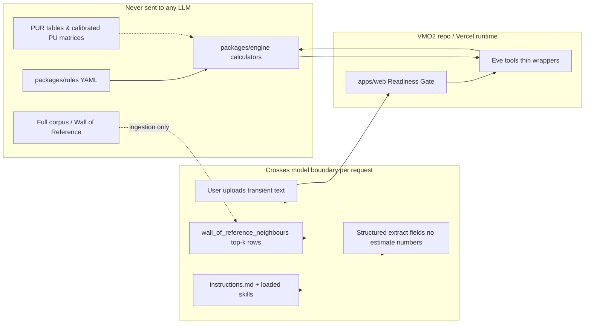

# SECURITY_DATAFLOW.md

One-page data-flow summary for the IA Agent (PROJECT_BRIEF §10.4). Use this with `model_bakeoff_report.md` for mentor review of cost and confidentiality.

## System boundary

## What crosses the model boundary

| Data | Stage | Purpose | Retention |
|---|---|---|---|
| User-upload document text (PDF/DOCX/XLSX → text) | Stage 1 `classify_documents`, Stage 2 extract | Readiness checklist + field extraction | Transient per request via AI Gateway; not written to corpus by default |
| `instructions.md` + on-demand skills | Both | Methodology and workflow (no calibrated numbers) | Versioned in git; sent as system context |
| `wall_of_reference_neighbours` top-k rows | Stage 2 explain / neighbour lookup | Analogue project names + PU/cost for cited rows only | Retrieved at runtime; never full Wall JSON |
| Tool outputs (extract, gap, scores) | Stage 2 | Structured JSON without letting the model emit PU/£ directly | Session transcript only |

## What never crosses the model boundary

- All calibrated tables: PUR curve, BA/SA allocation, overlay vectors, complexity/ETL/MW/360 matrices, seed-funding anchors, confidence anchors.
- Full `packages/rules/` YAML and `corpus/` (59 Vision Cards, filled templates, wall_of_reference source).
- Engine arithmetic — the LLM must call tools; tools import `packages/engine` only.

## Two-stage model policy (§10–§11)

| Stage | Tool / path | Model slot | Emits numbers? |
|---|---|---|---|
| 1 — Readiness | `classify_documents` | `MODEL_CLASSIFY` (cheap tier, env override) | No — doc type + checklist status only |
| 2 — Estimate | extract → `gap_report` → `score_*` / `estimate_*` / `apply_pur` | `MODEL_EXTRACT` (quality tier, env override) | Only via tool returns |

Golden tests and engine vitest remain model-invariant.

## Knowledge architecture (§10)

1. **No calibrated numbers in agent knowledge** — skills and instructions reference tools/rules; CI `pnpm test:leak-check` fails on YAML number leaks.
2. **No fine-tuning** — knowledge = git-versioned skills + deterministic tools + top-k retrieval.
3. **User uploads are transient** — per-request Gateway calls; corpus and rules stay in VMO2 storage/repo.
4. **Rates change in YAML** — redeploy only; nothing retrains.

## Provider / enterprise terms (action for VMO2)

Confirm with procurement/legal that the chosen AI Gateway provider(s) under the VMO2 enterprise plan:

- **Exclude customer inputs from model training** (zero-retention / opt-out as applicable).
- Document **data residency** options (EU/UK) for Gateway routing and logging.
- Align with internal policy on uploading NDA Vision Cards (transient processing still counts as processing).

Until confirmed, treat uploads as **Internal** data and restrict live demos to sanitised corpus copies.

## Human-in-the-loop & audit

- IA sign-off states (walkthrough → verbal → written) map to Eve approval gates on sensitive tools (future).
- Every user-visible figure must carry **rule id + evidence span** from tool provenance.
- Session logs on Vercel should exclude raw document storage unless explicitly enabled for support.

## Related files

- `PROJECT_BRIEF.md` §10–§11
- `packages/rules/` — sole home for calibrated config
- `scripts/check-knowledge-leak.ts` — CI guardrail
- `agent/tools/classify_documents.ts` — Stage 1 boundary
